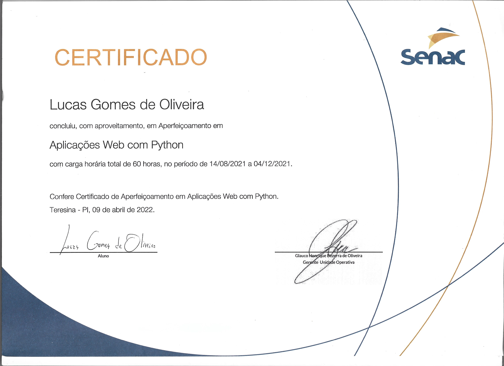
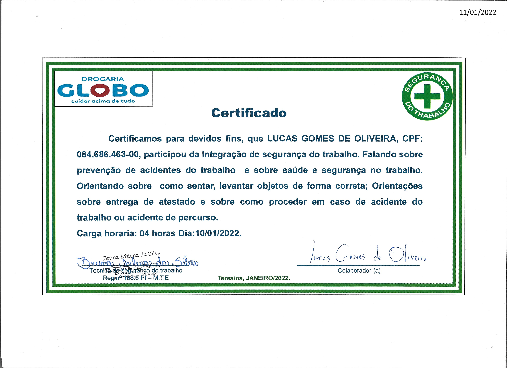

In this section, you'll be able to discover a list of professional certifications that showcase qualifications and adherence to industry standards, ensuring expertise and credibility.

<!-- Hugo theme Stack supports the creation of interactive image galleries using Markdown. It's powered by [PhotoSwipe](https://photoswipe.com/) and its syntax was inspired by [Typlog](https://typlog.com/).

To use this feature, the image must be in the same directory as the Markdown file, as it uses Hugo's page bundle feature to read the dimensions of the image. **External images are not supported.** -->

<!-- ## Syntax

```markdown
### Test 1

```

```markdown
### Test 2

``` -->

 

 

 






<!-- > Photo by [mymind](https://unsplash.com/@mymind) and [Luke Chesser](https://unsplash.com/@lukechesser) on [Unsplash](https://unsplash.com/) -->